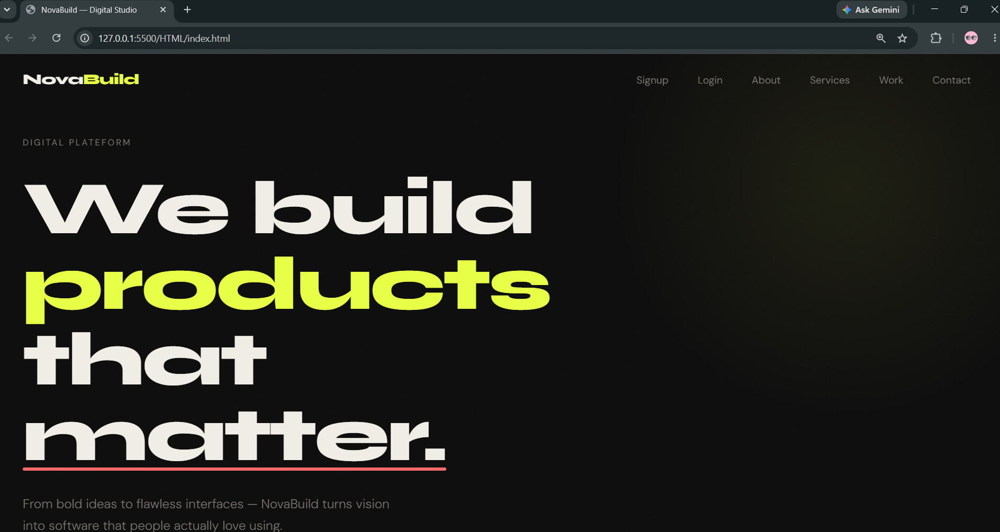
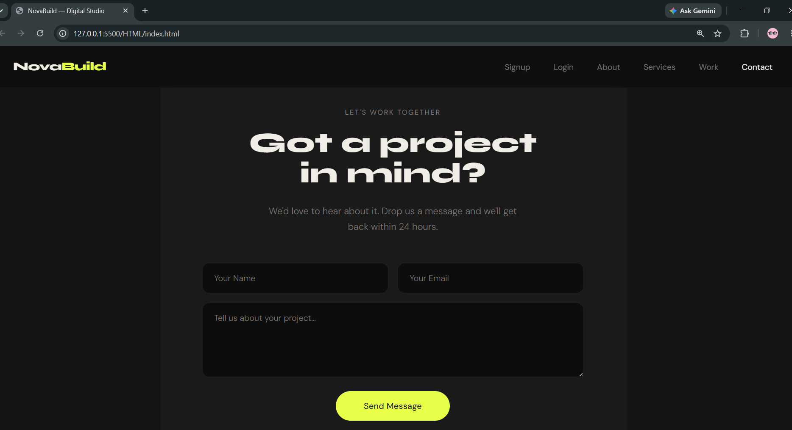
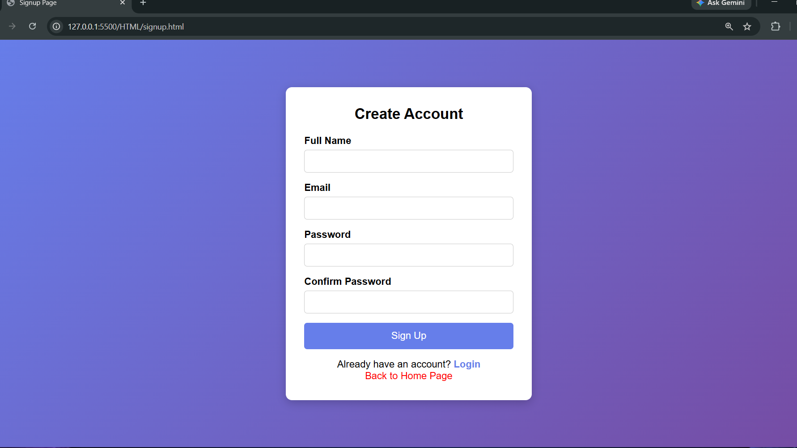
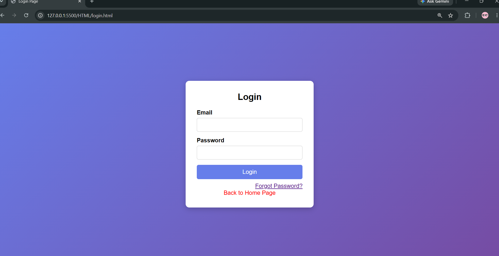
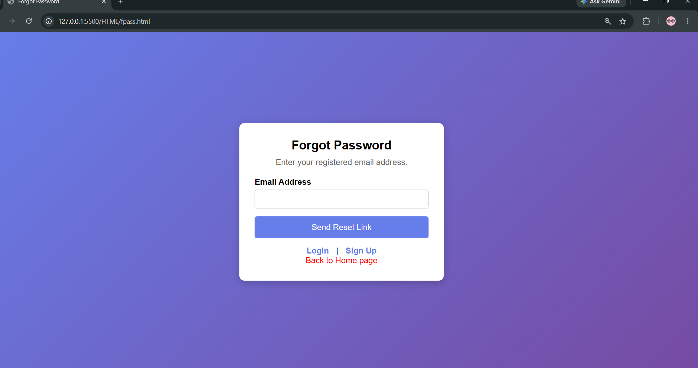

# NovaBuild — Landing Page

A clean, modern landing page built with vanilla **HTML**, **CSS**, and **JavaScript**. No frameworks, no build tools — just well-structured, production-ready code.


## ✨ Features

- **Sticky Navbar** — becomes frosted-glass on scroll, mobile hamburger menu
- **Hero Section** — large typography, animated underline, scroll hint
- **Marquee Strip** — infinite scrolling ticker
- **About Section** — two-column layout with animated stats
- **Services Grid** — 4-column card grid with hover effects
- **Work / Portfolio** — project cards with accent colours per card
- **Contact Form** — inline validation and simulated form submission
- **Scroll Reveal** — staggered IntersectionObserver animations
- **Fully Responsive** — breakpoints at 1024px, 768px, and 480px

## 🎨 Design Tokens

All design decisions live in CSS custom properties at the top of `style.css`:

| Variable     | Value       | Purpose               |
|--------------|-------------|-----------------------|
| `--bg`       | `#0d0d0d`   | Page background       |
| `--text`     | `#f0ede6`   | Primary text          |
| `--accent`   | `#e8ff47`   | Primary accent (lime) |
| `--accent-2` | `#ff6b6b`   | Secondary accent (red)|
| `--muted`    | `#7a7672`   | Muted / secondary text|


## 🚀 Getting Started

No installation needed. Just open `index.html` in a browser:

```bash
# Clone the repository
git clone https://github.com/ipravin07/NovaBuild-project

# Open in browser
cd novabuild-landing
open index.html
```

Or use [Live Server](https://marketplace.visualstudio.com/items?itemName=ritwickdey.LiveServer) in VS Code for hot reload.

## 🛠 Customisation

1. **Content** — Edit text, links, and project details in `index.html`
2. **Colours** — Change CSS variables in the `:root` block at the top of `style.css`
3. **Fonts** — Swap the Google Fonts import in `index.html` and update `--font-head` / `--font-body`
4. **Form** — Replace the `setTimeout` in `script.js` with a real API call (e.g. Formspree, EmailJS)

## 📸 Screenshots








## 👨‍💻 Author

**Pravin Mishra**

* GitHub: https://github.com/ipravin07


## 📄 License

MIT — free to use, modify, and distribute.